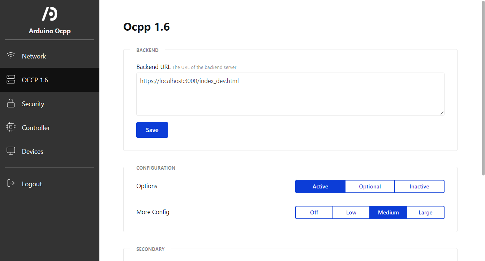

# Dashboard for Arduino OCPP

This is a web-based dashboard for the Arduino OCPP library.

## Starting development

To install this project, node.js and npm (node package manager) need to be installed on your machine. You can check if those are installed in your current directory by running the commands:

`node --version`

`npm --version`

Then you should:

1. Clone the repositiory
2. Enter the root directory
3. Run `npm install`
4. Run `npm run dev`

In a short time a development server at http://localhost:3000 should be started.

## Build the project

1. Enter the root directory of the project
2. Run `npm run build`
3. The compiled JavaScript file is now in the /dist directory

At this moment only the Javascript part of the application is compiled automatically. Also the files are not automatically gzipped. This means that a production version needs to be manually put together. This can be fixed in the future with an automatic script.